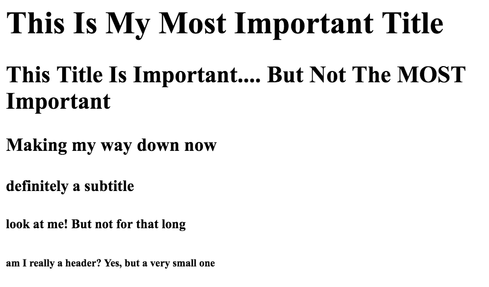

# Biography Lab: Introduction to HTML

## The Goal

You have just received the news that your favorite public figure is in the market for a new personal website. Eager to show off how much you know about them, and put your HTML skills to good use, you've decided to make them their very own site. By the end of this lab you'll have an HTML file ready to preview that holds tons of interesting information about your favorite public figure.

## The Lab

Throughout this lab you'll be working in the index.html file provided. After choosing your favorite public figure (this can be anyone from Ariana Grande to Bill Gates), follow the steps below to make sure that your website contains everything it needs to *break the internet*. Each step will contain background information to help you complete the task. The actual actions you need to complete will be bolded text within those steps.

### Step One: Getting Started and Using Comments

**Open up the index.html file and familiarize yourself with the setup of the document.** The boilerplate code you see is from [here](http://htmlshell.com), a great resource for your future HTML setup.

In this lab, we'll be focusing on the information between the two body tags
```<body></body>```. This is where the information that appears on our page is located. Remember, tags generally come in pairs with the end tag having a "/" character.

On line 8, you'll see the following code. This is a comment and won't actually change what shows up when you preview your HTML. To add a comment you can copy the ```<!-- -->``` characters and write between the two arrows. Alternatively, you can press the command key and the question mark key to automatically insert those characters.
```html
<!-- Insert your website code below here! (This is a comment, it won't impact how your website looks) -->
```
Comments are useful to make your code more readable for yourself and others. **Add a commend on line 9 with the name of the person you've chosen to make your website about.**

**To preview your HTML press ctrl-shift-H.**

### Step Two: Headers

Now that we've refreshed our memory on the general setup of the html file, lets get started with adding our own tags. To begin, you'll probably want to add a title to your page. Note, this is different from the title tag that is already in your html, copied below:

```html
<head>
  <meta charset="UTF-8">
  <title>Biography Lab</title>
</head>
```

The title tag doesn't actually make anything appear on the screen (as you have seen from previewing your html in step one). In order to add a visible title, we're going to use header tags. An example of html using header tags and the corresponding preview that results are below.

```html
<h1> This Is My Most Important Title </h1>
<h2> This Title Is Important.... But Not The MOST Important </h2>
<h3> Making my way down now </h3>
<h4> definitely a subtitle </h4>
<h5> look at me! But not for that long </h5>
<h6> am I really a header? Yes, but a very small one </h6>
```


As you can see, header tags go from h1 to h6. Tags closer to h1 should contain more important information and tags closer to h6, less important.

##### Part A
**Add an h1 tag containing your pages title to the html file below the comment that says "Add your title below this line"**

##### Part B
**Add at least three subtitles. These can be any combination of h2-h6 tags.** One subtitle has already been added for you, replace the text with a subtitle that you want, then add three more. These will signify the sections of your page, for example: Personal Life, Career, Fun Facts, Education, Songs, etc.

### Step 3: Filling in the Information

Now that you've added in your headers, it's time to fill these sections in with information! In order to add paragraphs of text to our page, we'll use the paragraph tag. An example of this is below:

```html
<p> Here's an example of me writing a paragraph inside of some very lovely paragraph tags. Some may even say that they are the loveliest of all of the paragraph tags. </p>

<p> But wait, there's more... new information! new paragraph! new tags!</p>
```


**Add at least 2 sentences of information below each subtitle that you created in Step 2. One paragraph tag has already been provided for you, replace the text inside of this tag with the appropriate information.** Keep whatever websites you use for information open, you'll be using them again in the next step.

### Step 4: Link it Up

Information is great... but how do people know that they can trust your information? By looking at your references! In order to make our website more trustworthy we're going to add links to our sources in a sources area of our website.

##### Part A:

**Add a header tag with inside text that says "Sources" to separate this section of the page.**

##### Part B:

Below this heading, you'll be adding links. In order to add links that a user can click, we use the anchor tag, or the a tag. To correctly link a website we need to complete four steps:

1. Create the a tags.
```html
<a> </a>
```
2. Write the text we want to display.
```html
<a> Source 1 </a>
```
3. Add our href attribute (an attribute is something that is added INSIDE of the opening tag). This attribute tells our page where to send the user when they click on this tag.
```html
<a href=""> Source 1 </a>
```
3. Finally, copy in the url of our source website in between the quotes that href is set equal to.
```html
<a href="https://www.google.com"> Source 1 </a>
```

**Copy and paste the example code from the third step to creating an a tag above into your HTML below the sources heading. Preview your page to ensure you have working link. Next, change "https://www.google.com" to be a specific source that you used.**

##### Part C
**Follow the steps above to add 3 more a tags that reference sources that you used underneath the sources heading.**

### Step 5: Picture This

Our website is definitely full of information, and now people know that they can trust that information thanks to our sources. However, it's not very fun to look at right now. In order to spruce it up, you'll be adding in some images! We add images to our page by using the image tag.

The image tag is slightly different from the other tags we've looked at because it *doesn't have an end tag*. Meaning, in this case we don't have a pair of tags, just one. To correctly create an image we'll need to complete the following steps:

1. Create the img tag.
```html

```
2. Add the src attribute. As discussed in the anchor tags, attributes are information that goes INSIDE of the tag. The src attribute tells your page where to get the image it is going to display.
```html

```
3. Fill in the correct value for the src attribute. This can be a link to an image or the name of the file on your computer. The example code below uses the dog.jpeg file in this folder.
```html

```
4. Add the alt attribute. This tells your website what to display if it cannot find the image file you've set the src attribute equal to.
```html

```
5. Fill in the value for the alt attribute.
```html

```

##### Part A:
**Copy and paste the `````` into your HTML file directly below your h1 tag with the title of your page in it. Preview your page and make sure that the picture of a dog is now coming up. Replace the "dog.jpeg" with an image of your chosen public figure and the "Image of Dog" with something that makes sense for your new photo.**

##### Part B:
**Follow the steps above and create at least two more image tags for your page. You can find these images online and add them to any location on your page that you feel makes sense.**

Congratulations! You have a wonderful website with lot of useful and trustworthy information! A website designer's job is never truly done, so if there are more sections, bits of information, sources, or images that you want to add keep going! If you're looking for some more challenges, check out the extensions section below...

## Extensions:
Completing these tasks will most likely require you to search terms and find documentation/examples online. [This](https://www.w3schools.com/tags/default.asp) will likely be a useful resource for you.

1. Now that you have the tools to create an anchor tag AND the tools to create an image tag, try creating an image that links to a website. Rather than replacing the text inside of the a tags, with words, try replacing it with a full image tag. Feel free to look online for help!
2. Go online and research two additional kinds of HTML tags. Add these to your website! You make want to look up list tags or try creating a details tag.
3. Try adding a video to your page! Take a look at the iframe tag documentation to get yourself started.
